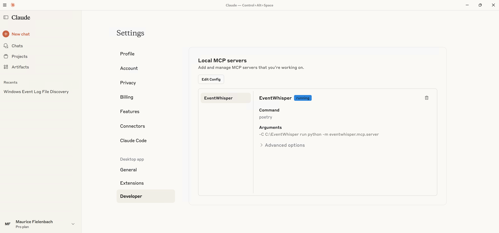
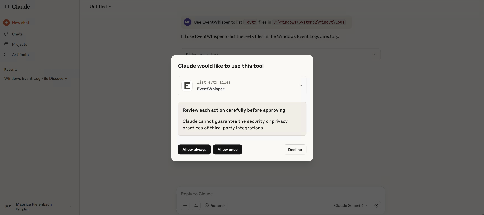

https://github.com/user-attachments/assets/159821fe-571a-4f8c-85a3-383f5360b84a
# EventWhisper — A Windows Event Log MCP

[](https://github.com/hexastrike/eventwhisper/actions/workflows/ci.yml)
[](https://codecov.io/gh/hexastrike/eventwhisper)
[](#)
[](LICENSE)
[](#)

**EventWhisper** exposes fast, scriptable access to Windows `.evtx` logs via an MCP (Model Context Protocol) server.
It’s pure Python (uses the `evtx` library), instead of a PowerShell wrapper and does not execute commands on the host — safer for incident response, digital forensics, and threat hunting.

The server exposes two primary tools:

- List EVTX files (optionally recursive) for any directory.
- Filter events to directly search for specific records.

Built specifically for IR/DFIR & hunting so you don’t need to look up Event IDs all day. Designed, developed, and tested on Windows with Claude — and usable from any MCP client.

---

## Features

- **Targeted filtering**: time window, EventID(s), and case-insensitive keywords (include/exclude)
- **Field projection**: return only the dotted paths you need (huge output reduction)
- **Input normalization**: accepts flexible input formats so it still works if types/format aren’t perfect.
- **MCP-ready**: plugs into Claude Desktop (and other MCP clients)

---

## Demo

https://github.com/user-attachments/assets/e1878c86-56f6-466b-bbc4-04d1edeeb36b

---

## Requirements (Windows)

EventWhisper can be set up with Poetry, whether you run it **inside Claude** or **standalone**.
On Windows, make sure Poetry is on your `PATH`.

**Install Poetry (PowerShell):**

```powershell
(Invoke-WebRequest -Uri https://install.python-poetry.org -UseBasicParsing).Content | py -
```

**Add Poetry to PATH (user install):**

```powershell
C:\Users\<YourUser>\AppData\Roaming\Python\Scripts
```

**Verify:**

```powershell
poetry --version
```

---

## Install & Run

Primarily developed for use with Claude, but you can run the MCP server standalone and plug it into other LLMs.

**Clone and install:**

```powershell
git clone https://github.com/hexastrike/eventwhisper
cd eventwhisper
poetry install
```

**Run the MCP server:**

```powershell
poetry run python -m eventwhisper.mcp.server
# (or) plain Python if deps are installed globally:
python -m eventwhisper.mcp.server
```

---

## Claude MCP configuration

Add this to Claude Desktop’s MCP config (e.g., `%AppData%\Claude\claude_desktop_config.json`):

```json
{
  "mcpServers": {
    "EventWhisper": {
      "type": "stdio",
      "command": "poetry",
      "args": [
        "-C",
        "C:\\Path\\To\\eventwhisper",
        "run",
        "python",
        "-m",
        "eventwhisper.mcp.server"
      ],
      "env": { "PYTHONIOENCODING": "utf-8" }
    }
  }
}
```

Open **Settings → Developer** to confirm EventWhisper is registered and “running”.



When prompted, allow the tool:



Try a first prompt:

> Use EventWhisper to list `.evtx` files in `C:\Windows\System32\winevt\Logs`.

---

## Development

EventWhisper was written to be simple and maintainable. We use pytest for tests and ruff for linting/formatting.
Run everything locally (or via pre-commit):

```powershell
poetry install
poetry run ruff format .
poetry run ruff check . --fix
poetry run pytest --cov=eventwhisper --cov-report=term-missing
# pre-commit on all files:
poetry run pre-commit run --all-files
# pre-push hooks (full tests + coverage):
poetry run pre-commit run --hook-stage push --all-files
```

When making pull requests, ensure all tests pass and coverage thresholds are met.
Every new utility or feature should include clear tests and follow PEP 8. Tests live in the `tests/` directory.

### Core layout & API

Primary logic lives in `eventwhisper/evtxio/evtxio.py` — EVTX iteration/filtering/projection.

The core server function is `get_events_from_evtx()` (a wrapper around the iterator `iter_events_from_evtx()`):

```python
def get_events_from_evtx(
    provider: str | Path,
    start: datetime | str | None = None,
    end: datetime | str | None = None,
    results_limit: int | str | None = RESULTS_LIMIT,
    event_ids: int | str | Sequence[int] | Sequence[str] | None = None,
    contains: str | Sequence[str] | None = None,
    not_contains: str | Sequence[str] | None = None,
    fields: str | Sequence[str] | None = None,
) -> list[str]:
```

Constants live in `eventwhisper/utils/config.py` and include both:

- `RESULTS_LIMIT` — max number of events returned (LLMs have token/char caps).
- `SCAN_LIMIT`  — max events scanned to keep responses fast on huge logs.

### Example Python usage
```python
# example.py
from __future__ import annotations
from datetime import datetime, timezone
from eventwhisper.evtxio.evtxio import get_events_from_evtx

# 1) First matching event from Security log
print(get_events_from_evtx(r"C:\Windows\System32\winevt\Logs\Security.evtx", results_limit=1))

# 2) Filter by keywords and project fields
events = get_events_from_evtx(
    r"C:\Windows\System32\winevt\Logs\Security.evtx",
    contains=["powershell", "Invoke-"],
    fields=["Event.System.EventID", "Event.EventData.Image", "Event.EventData.CommandLine"],
    results_limit=5,
)
for e in events:
    print(e)

# 3) Time-bounded query (UTC)
start = datetime(2025, 1, 1, tzinfo=timezone.utc)
end = datetime(2025, 1, 31, 23, 59, 59, tzinfo=timezone.utc)
print(len(get_events_from_evtx(r"C:\Windows\System32\winevt\Logs\Security.evtx", start=start, end=end)))
```

Run it with `poetry run python example.py`.

## Troubleshooting

- **Big logs:** results are capped by `RESULTS_LIMIT` and scanning is bounded to keep responses fast. If your MCP client doesn’t realize results are capped, run a second, narrower query.
- **“Blocked” files:** if you downloaded `.evtx` from the Internet, right-click → **Properties** → **Unblock**.
- **Paths:** in Python, prefer raw strings for Windows paths, e.g., `r"C:\path\file.evtx"`.
- **README video:** GitHub doesn’t render `<video>`; use a thumbnail → MP4 link (see Demo section).

---

## Roadmap

- Faster scanning for very large `.evtx` files
- Better normalization for malformed/corrupted EVTX
- Convenience utilities (e.g., quick overview: counts, unique EventIDs, time range)
- Optional paging / multi-query strategies for huge datasets

---

## License

Distributed under the **GPLv3**. See [LICENSE](LICENSE).
